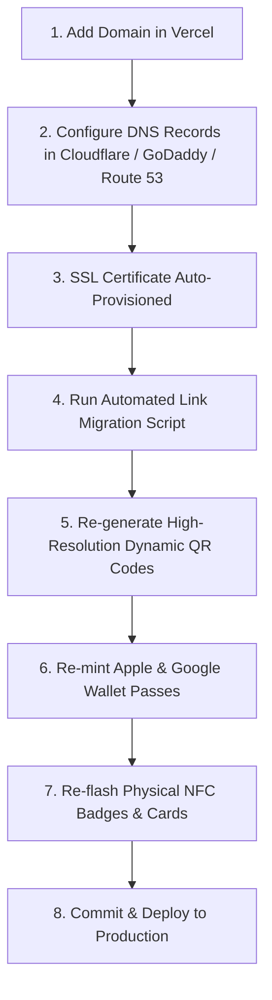

# P-22 CORP — CUSTOM DOMAIN MIGRATION & ASSET SYNC PLAYBOOK
**Document Version:** 4.0.0 (Production Release)  
**Scope:** DNS Setup, Vercel Custom Domain Configuration, URL Inventory, QR Code Regeneration & NFC Programming  
**Author:** Antigravity Engineering Suite  
**Target Domains (Examples):** `card.p22corp.com`, `id.p22corp.com`, `connect.p22corp.com`, `p22corp.com`

---

## 1. Executive Summary & Migration Workflow

When transitioning from the Vercel default domain (`https://card.p22corp.com`) to an official corporate domain (e.g., `https://card.p22corp.com`), several interconnected components must be synchronized to prevent broken NFC links, stale QR codes, and invalid wallet passes.



---

## 2. Step 1: DNS & Vercel Custom Domain Configuration

### Option A: Subdomain (Recommended) — `card.p22corp.com` or `id.p22corp.com`
In your DNS provider (Cloudflare, GoDaddy, Namecheap, Google Domains, Route 53):

| Type | Name / Host | Value / Target | TTL | Proxy Status |
|---|---|---|---|---|
| **CNAME** | `card` (or `id`) | `cname.vercel-dns.com` | Auto (or 300) | DNS Only (Gray Cloud if Cloudflare) |

### Option B: Apex Domain — `p22corp.com`
| Type | Name / Host | Value / Target | TTL |
|---|---|---|---|
| **A** | `@` | `76.76.21.21` | Auto (or 300) |
| **CNAME** | `www` | `cname.vercel-dns.com` | Auto (or 300) |

### Configure in Vercel Dashboard:
1. Navigate to **Project Settings -> Domains**.
2. Click **Add Domain** and enter `card.p22corp.com`.
3. Vercel will verify the DNS record within 30-120 seconds and issue a free DigiCert/Let's Encrypt SSL certificate automatically.

---

## 3. Step 2: Comprehensive URL Inventory in Codebase

The following files contain hardcoded canonical domain strings that must be updated upon domain migration:

| File Path | Description of URL References |
|---|---|
| **`team.json`** | Canonical `url`, `walletShareUrl`, `googleWalletUrl`, `vcf` data strings for all 5 representatives. |
| **`setup.html`** | Default base domain variable (`DEFAULT_BASE_URL`), fallback URLs, sample links. |
| **`badge.html`** | `targetUrl = window.location.origin + '/' + activeRep.slug` (automatically adapts to current domain). |
| **`pedro.html`** | Canonical meta tags, OpenGraph `og:url`, vCard download URLs, pass links. |
| **`eduardo.html`** | Canonical meta tags, OpenGraph `og:url`, vCard download URLs, pass links. |
| **`marleni.html`** | Canonical meta tags, OpenGraph `og:url`, vCard download URLs, pass links. |
| **`logistics.html`** | Canonical meta tags, OpenGraph `og:url`, vCard download URLs, pass links. |
| **`bids.html`** | Canonical meta tags, OpenGraph `og:url`, vCard download URLs, pass links. |
| **`index.html`** | Root redirect canonical references. |
| **`assets/vcf/*.vcf`** | The `URL:` field in all generated vCards. |
| **`scripts/verify-production-health.js`** | `BASE_URL = 'https://card.p22corp.com'` |

---

## 4. Step 3: Automated One-Click Domain Migration Script

To avoid manual editing across dozens of files, run the automated domain sync script:

### Usage:
```bash
node scripts/migrate-domain.js "https://card.p22corp.com"
```

*(Script code provided below in Section 8).*

---

## 5. Step 4: Re-Generating QR Codes & Dynamic Assets

When the domain changes, all QR codes must encode the new canonical URL:

### Representative QR Target Matrix:
- **Pedro Felipe:** `https://card.p22corp.com/pedro` (or Edge Short-Link `https://card.p22corp.com/r/pedro`)
- **Eduardo López:** `https://card.p22corp.com/eduardo` (or Edge Short-Link `https://card.p22corp.com/r/eduardo`)
- **Marleni Méndez:** `https://card.p22corp.com/marleni` (or Edge Short-Link `https://card.p22corp.com/r/marleni`)
- **Procurement Bids:** `https://card.p22corp.com/bids` (or Edge Short-Link `https://card.p22corp.com/r/bids`)
- **Dallas Logistics:** `https://card.p22corp.com/logistics` (or Edge Short-Link `https://card.p22corp.com/r/logistics`)

### Best Practice: The `/r/[rep]` Edge Redirect Strategy
Always encode the short-link `https://card.p22corp.com/r/[rep]` onto physical merchandise, printed banners, business cards, and NFC chips.
- **Why?** The `/r/[rep]` edge router executes a sub-40ms 302 redirect in Vercel Edge Middleware. If you ever change routing in the future (e.g. migrating to a native mobile app or custom portal), you can redirect traffic server-side without re-printing QR codes or re-purchasing physical NFC hardware!

---

## 6. Step 5: NFC Card & Badge Reprogramming Protocol

### Hardware Requirements:
- NTAG213, NTAG215, or NTAG216 standard ISO 14443-A NFC chips (metal cards, PVC cards, smart stickers, or wristbands).

### Smartphone Tool:
- Download the free **NFC Tools** app (available on iOS App Store & Google Play Store).

### Flashing Procedure:
1. Open **NFC Tools**.
2. Select **Write** -> **Add a record**.
3. Choose **Custom URL / URI**.
4. Enter the Edge Redirect URI for the specific staff member:  
   `https://card.p22corp.com/r/pedro`
5. Tap **OK** -> tap **Write / 18 Bytes**.
6. Hold the top edge of your phone against the physical NFC card or badge until the success confirmation chime sounds.
7. Test immediately: Lock the phone, tap the card against any iPhone or Android. The browser will instantly load the representative's profile.

---

## 7. Step 6: Apple & Google Wallet Re-Minting

1. Update the base URL in `scratch/mint_walletwallet_passes.py`:
   ```python
   BASE_URL = "https://card.p22corp.com"
   ```
2. Execute the pass minting script to re-sign `.pkpass` bundles and update the Google Pay JWT tokens:
   ```bash
   python scratch/mint_walletwallet_passes.py
   ```
3. Commit and deploy:
   ```bash
   git add .
   git commit -m "chore(domain): migrate canonical links to card.p22corp.com"
   git push origin main
   npx vercel --prod --yes
   ```

---

## 8. Automated Migration Script Reference (`scripts/migrate-domain.js`)

```javascript
/**
 * P-22 Domain Migration Utility
 * Usage: node scripts/migrate-domain.js "https://card.p22corp.com"
 */
const fs = require('fs');
const path = require('path');

const targetDomain = process.argv[2];
if (!targetDomain || !targetDomain.startsWith('http')) {
  console.error('Usage: node scripts/migrate-domain.js "https://your-domain.com"');
  process.exit(1);
}

const cleanDomain = targetDomain.replace(/\/$/, '');
const oldDomain = 'https://card.p22corp.com';

console.log(`Migrating P-22 URLs from [${oldDomain}] to [${cleanDomain}]...`);

const filesToUpdate = [
  'team.json',
  'setup.html',
  'badge.html',
  'pedro.html',
  'eduardo.html',
  'marleni.html',
  'logistics.html',
  'bids.html',
  'index.html',
  'scripts/verify-production-health.js',
];

for (const file of filesToUpdate) {
  const filePath = path.join(__dirname, '..', file);
  if (fs.existsSync(filePath)) {
    let content = fs.readFileSync(filePath, 'utf8');
    if (content.includes(oldDomain)) {
      content = content.split(oldDomain).join(cleanDomain);
      fs.writeFileSync(filePath, content, 'utf8');
      console.log(`  [OK] Migrated: ${file}`);
    } else {
      console.log(`  [-] No occurrences found in: ${file}`);
    }
  }
}

console.log('\nDomain migration complete! Re-run audit: node scripts/audit-all-users.js');
```
